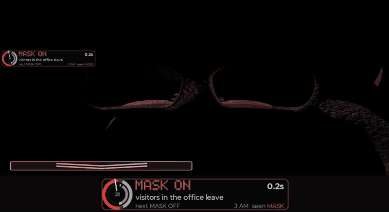
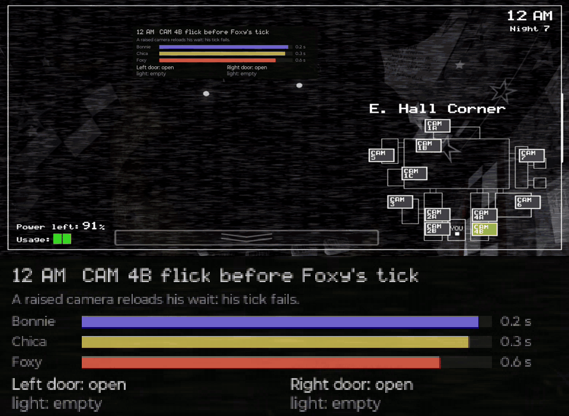

# fnaf2-1020

**A bot that plays the first four *Five Nights at Freddy's* games on a real Android phone, working toward
clearing every night of every game, and the reverse-engineered model of each game that tells it what to do.**

[](https://github.com/ppvaz/fnaf2-1020/actions/workflows/ci.yml)
[](LICENSE)

**[Try the trainer in your browser](https://ppvaz.github.io/fnaf2-1020/)** · [Scoreboard](#scoreboard) ·
[What's different](#whats-different-here) · [Start here](#start-here) · [How it works](#how-it-works) ·
[Credits](#credits-and-lineage)

| FNaF 2 at 10/20 | FNaF 1 at 4/20 |
|---|---|
|  |  |
| <sub>All ten animatronics at the maximum, 20. One cycle of Zach_Scream's Minus Toys route, 3 AM, 2026-09-18.</sub> | <sub>All four animatronics at 20. The route runs on Bonnie's, Chica's and Foxy's own move clocks. This night was screen-recorded and died at 2 AM; the two 4/20 clears ran without a recording, which halves the frames the bot reads. 2026-09-25.</sub> |

The panel enlarged under each clip is the bot's own overlay: where it is in its route, and what it has read off
the screen.

## Scoreboard

The goal is every night of all four games on an unmodified retail install, 28 nights in all. **12 are cleared
on the phone so far, including the hardest mode of FNaF 1 and of FNaF 2.**

| Game | Nights | Cleared on the phone | In the model |
|---|---|---|---|
| FNaF 1 | 7 | **Night 7 at 4/20**, the hardest mode, on the first attempt; 2 of the 4 attempts in the record reached 6 AM ([record](docs/evidence/fnaf1-420-first-6am-20260925.json)) | the winning 4/20 route survives all 65,536 seeds in the typical lane, 94.7% in the worst ([census](docs/evidence/fnaf1-420-winner-route-population-20260927.json)) |
| FNaF 2 | 7 | **All 7**, including Custom Night at **10/20**. 47 clears promoted; **8 of 10** in a predeclared 10/20 test ([record](docs/evidence/night7-cohort-k3-result-20260918.json)) | the committed routes win all 65,536 seeds on every night in the exact lane, which leaves out press lateness ([census](docs/evidence/fnaf2-winner-census-20260925.json)) |
| FNaF 3 | 6 | **Night 1**, a night with no threats, played with no input ([record](docs/evidence/fnaf3-first-night-20260920.json)) | at the phone's pace, the phone's loop wins Night 2 on 2,732 of 3,000 seeds and Night 6 (Nightmare) on about 69%, in both seed blocks ([census](docs/evidence/fnaf3-camera-economy-census-20260925.json)) |
| FNaF 4 | 8 | **Nights 1–3**; the best Night 4 attempt in that record died 0.24 s before 6 AM ([record](docs/evidence/fnaf4-nights-1-3-20260925.json)) | the published loop wins Nights 1–4 on all 3,000 seeds of two blocks, and no seed of Nights 7–8 ([census](docs/research/FOUR-GAME-NIGHTS.md)) |

<sub>"Cleared on the phone" means the retail game reached 6 AM on a real phone (`DEVICE_MEASURED`). "In the model"
means the reverse-engineered simulator, over all 65,536 seeds or over two 3,000-seed blocks (`MODEL_ONLY`). The
two labels never promote each other. A clear is one night, not a reliability rate.</sub>

**Also:** all four games have been rebuilt from the compiled logic of their Android releases, with patched
mmfparser and Chowdren. Each rebuild converts, boots on the computer and packages as an APK, and the FNaF 2
rebuild boots on the phone. A rebuild is a second, independent reading of its game; so far FNaF 2's simulator is
the one checked against it ([build record](tools/recompile/results/game-builds-20260927.json)).

**Not claimed:**
- **That the models predict the phone move for move.** On a traced FNaF 2 night that reached 6 AM, the model
  matched only 2 of the phone's 11 occupied mask windows
  ([record](docs/evidence/model-encounter-fidelity-20260918.json)). Closing that gap is the current work.
- **Any phone but one.** Every device result comes from one Moto g56. No second handset has been qualified.
- **That any game is "solved".** [What solving FNaF 2 would mean](docs/research/SOLVING-FNAF2.md) lays out the
  rungs, and where this project stands on each.

## What's different here

The bot is one part of a small lab:

- **One method across four games.** Each game goes through the same chain: decompile it, model it, test the
  model over its seeds, play it on the phone, keep the evidence, and promote only what survives review. So far
  FNaF 2 is the only game through the whole chain.
- **The game's own logic is the reference.** Each game is decompiled into a rule-by-rule model and,
  separately, recompiled into a runnable game. When those two readings and the retail game disagree, the work
  is to find the decoding, translation or timing error behind it, and the retained experiments say which
  explanations were ruled out ([research frontier](docs/research/FNAF2-OBSERVATORY.md)).
- **Unmodified games, a real phone, measured limits.** Presses go through a virtual touchscreen that Android
  itself provides, and the routes are built on the phone's measured latencies and timing floors.
- **Every claim carries its evidence level,** and the mistakes made here that a machine can catch became
  automated checks.
- **Games small enough to reason about exactly.** FNaF 2's random numbers come from a 16-bit generator, so each
  night draws from one of 65,536 seeds. With an exact model, the ceiling on how often any player can win is
  computable ([what solving FNaF 2 would mean](docs/research/SOLVING-FNAF2.md)).

Not claimed: that these methods are new on their own. Black-box model learning, differential testing and
automated science all have precedent. What is being tested is their combination, on real hardware, across four
games of one series.

## Try it

**No install.** The [trainer](https://ppvaz.github.io/fnaf2-1020/) drills Niko Frost's Minus 7, the first
zero-RNG FNaF 2 10/20 route, as touch exercises in a phone browser held sideways. The trainer teaches Minus 7,
while the bot wins 10/20 with Minus Toys; [the lineage](docs/strategy/STRATEGY-HISTORY.md) covers both.

**With a checkout.** These commands need only Node 20+, plus Python 3 for the trainer:

```sh
npm ci
npm run evidence -- promotions                  # re-check every committed run pack against the promotion gate
npm run build:trainer && npm run serve:trainer  # the trainer on http://localhost:8731
```

The full test suite, `npm test` plus `npm run test:unit:slow`, needs what [CI](.github/workflows/ci.yml)
installs: Java 17, Python 3.12 with Pillow, NumPy and SciPy, ffmpeg, and a clone with full history. CI runs it
on Node 22. No phone is involved.

## Start here

| I want to… | You need | Go to |
|---|---|---|
| Judge whether this is new research | nothing | [What's different here](#whats-different-here) · [Research frontier](docs/research/FNAF2-OBSERVATORY.md) |
| Watch the bot play | nothing | the two clips above |
| See how the four games compare | nothing | [Four games' nights](docs/research/FOUR-GAME-NIGHTS.md) |
| Practise FNaF 2's 10/20 myself | a phone browser | [Trainer](https://ppvaz.github.io/fnaf2-1020/) |
| Know where the strategies came from | nothing | [Strategy history](docs/strategy/STRATEGY-HISTORY.md) |
| Look up how a mechanic really works | nothing (your own APK to re-derive it) | [Engine fact index](docs/android/UNIFIED-SOURCED-ENGINE-FACT-INDEX.md) |
| Check a claim myself | a checkout, Node 20+ | [Evidence policy](docs/evidence/README.md), then `npm run evidence -- list` |
| Find or tune a strategy | a checkout, Node 20+ | [Research lab](packages/research/README.md) |
| Ask it from my AI agent | a checkout, an MCP client | not built yet: [Plan 28](plans/28-solver-interface.md) |
| Understand how the rebuild works | nothing to read; your own APK and Docker to run it | [Recompile toolchain](tools/recompile/README.md) |
| Run the bot on my own phone | research only: a Moto g56 and the game | [Device safety](docs/operations/DEVICE-SAFETY.md), then the [device app](apps/device/README.md) |
| Give a fix back upstream | nothing | [Upstream ledger](UPSTREAM-LEDGER.md) |
| Work on this repository | a checkout | [Contributing](CONTRIBUTING.md), then [CLAUDE.md](CLAUDE.md) |

Everything else is in the [documentation index](docs/README.md), routed by question.

## How it works

1. **Source: read each game's own logic.** Starting from a copy of the APK you own,
   [CTFAK](https://github.com/CTFAK/CTFAK2.0) decodes the Clickteam event sheets. FNaF 2's office screen alone
   has 1,332 event groups, about 20,500 lines of dump. Each value in the FNaF 2 model is labelled: sourced (from
   an event group or an Android experiment), calibrated, inferred, or community behaviour the Android game has
   not confirmed. The same logic is also recompiled with mmfparser and Chowdren into a runnable game, a second
   reading that checks the first.
2. **Venues: play where it can be measured.** A route is a schedule of presses, or a small program that reacts
   to what it sees and hears. Routes for FNaF 1, 2 and 3 are scored in the simulator over the game's seeds;
   FNaF 4's phone loop has no model lane yet. FNaF 2's Minus Toys schedules can also be replayed in the rebuild
   on the computer. On the phone, a companion app reads small regions of the screen, and for FNaF 4, which is
   played by ear, the phone's audio streams to the computer over Bluetooth. The computer presses through
   Android's built-in `hid` tool over adb, a virtual touchscreen, with no root and no change to the game.
3. **Review: grade before believing.** Every night becomes a record of presses, readings and the reported
   outcome. Review tools then grade it again from the retained evidence. Each result is labelled `MODEL_ONLY`,
   `FIXTURE` or `DEVICE_MEASURED`, and no label upgrades to another. Refuted routes and retractions stay in the
   record ([evidence policy](docs/evidence/README.md)).

## How this was built

This is one person's project, built largely by directing AI coding agents. Most commits carry a
`Co-Authored-By: Claude` trailer. The repository is designed so that agent work gets checked, not trusted:

- **One operating contract.** Every agent reads [CLAUDE.md](CLAUDE.md). It includes a numbered register of
  mistakes agents made here, and a gate enforces the entries a machine can check.
- **No documentation-only commits without evidence.** A commit hook refuses them unless they stage or cite
  evidence, and its override is reserved for the maintainer.
- **Agents attest wins only through a command.** `npm run evidence -- attest` re-derives every check from the
  retained evidence and records who attested and what was verified. All 47 current promotions were attested
  this way, under a delegation recorded in CLAUDE.md.
- **The phone is guarded.** Every live night takes an exclusive lease on the phone, so only one program drives
  it at a time, and the FNaF 2 campaign runner stays a dry run without `--live --confirm-live`
  ([device safety](docs/operations/DEVICE-SAFETY.md)).
- **CI on every push to `master`.** It runs the typecheck, the unit, contract and model lanes, the census gates,
  a dry campaign over a committed winning route, and a link check over every Markdown file.

## Credits and lineage

**Strategies** come from the FNaF community; this project measures and executes them:
- Minus 7, the FNaF 2 route the trainer teaches, by Niko Frost (2023).
- Minus Toys, the FNaF 2 route the bot wins 10/20 with, by Zach_Scream (2025).
- Minus 3, by insstaa and Yunivers (2023).
- brayden's timer strategy, with Shooter25 (2024).
- Right Vent Camp, by the "Tactical Crew" and systematised by DJ Sterf (2021).

Shooter25's FNaF 2 practice mod is the strongest documented precedent for a bot inside the game
([bot census](docs/research/FNAF-BOT-CENSUS.md)). Mechanics are cross-checked against the
[Technical FNaF wiki](https://technicalfnaf.fandom.com/). The full lineage is in
[STRATEGY-HISTORY.md](docs/strategy/STRATEGY-HISTORY.md).

**Tools.** [CTFAK](https://github.com/CTFAK/CTFAK2.0) decodes the game data.
[Chowdren and mmfparser](https://github.com/fnmwolf/Anaconda) (matpow2's Anaconda, through the fnmwolf fork)
rebuild it. Every patch and finding owed back is tracked in the [upstream ledger](UPSTREAM-LEDGER.md).

## Legal and content boundary

- **Not affiliated.** This is independent research. It is not affiliated with, endorsed by, or sponsored by
  Scott Cawthon, Scott Games, or Clickteam. *Five Nights at Freddy's* is © Scott Cawthon; the names are used
  only to identify the games studied.
- **No game content here.** The repository holds no APKs, game assets, decompiled event sheets, generated
  source or rebuilt binaries. Dumps and rebuilds are written outside the checkout, and the APK and library
  build scripts refuse an output path inside it. The only screen captures are the two short clips above.
- **Bring your own copy.** Everything that reads or rebuilds a game needs a copy you own. Rebuilt games are
  research builds for your own device. The project never distributes them, and neither should you.
- **The retail games are not modified.** The bot plays the unmodified apps through Android's standard touch
  input. It does not patch them or bypass their anti-tamper protection.
- **License.** This project's own code and documentation are under the MIT license ([LICENSE](LICENSE)).
  Patches to third-party tools keep those tools' licenses: the Anaconda patches under `tools/recompile` are
  GPL, as their upstream is ([NOTICE](NOTICE)). The trainer's fonts are under the SIL Open Font License 1.1
  ([assets/fonts](assets/fonts/)). None of these licenses covers the games.

## Project status

| | |
|---|---|
| Nights cleared on the phone | **12 of 28** across the four games |
| Promoted 6 AM clears (FNaF 2) | **47**: Nights 1–4 two each, Night 5 seven, Night 6 eight, Night 7 twenty-four ([record](docs/evidence/plan12-promotions-20260927.json)) |
| Newest record | [FNaF 2 rebuild boots on the phone](tools/recompile/results/fnaf2-practice-20260928.json) (2026-09-28) |
| Working on | encounter-level fidelity for FNaF 2, and the remaining nights of FNaF 1, 3 and 4 ([roadmap](plans/ROADMAP.md)) |
